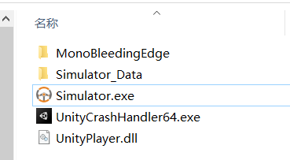
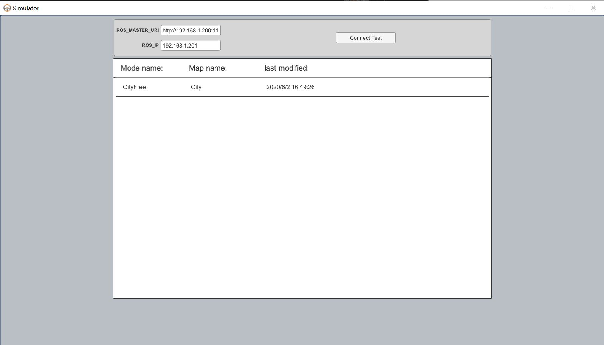
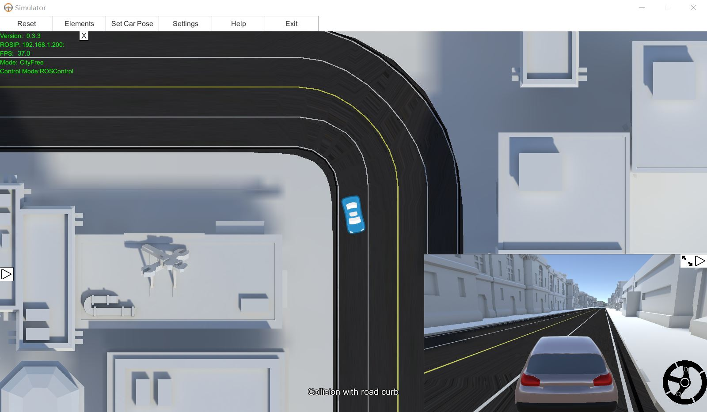
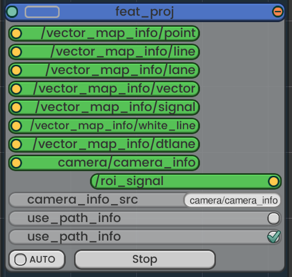
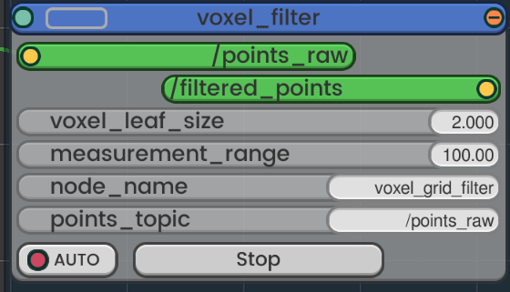
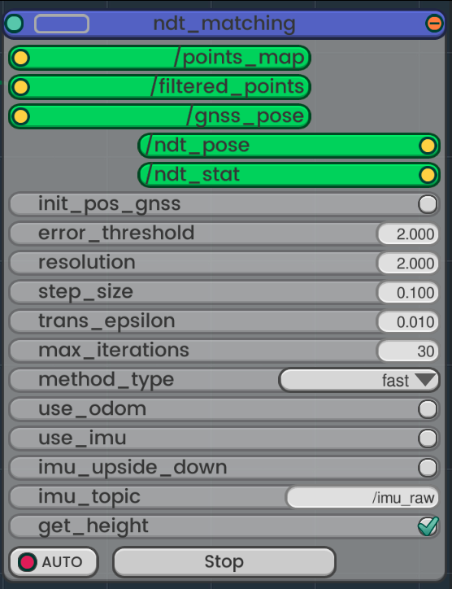
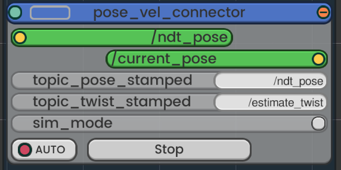
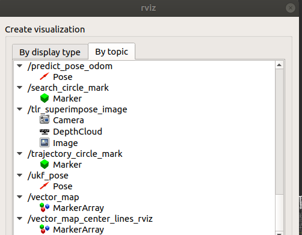
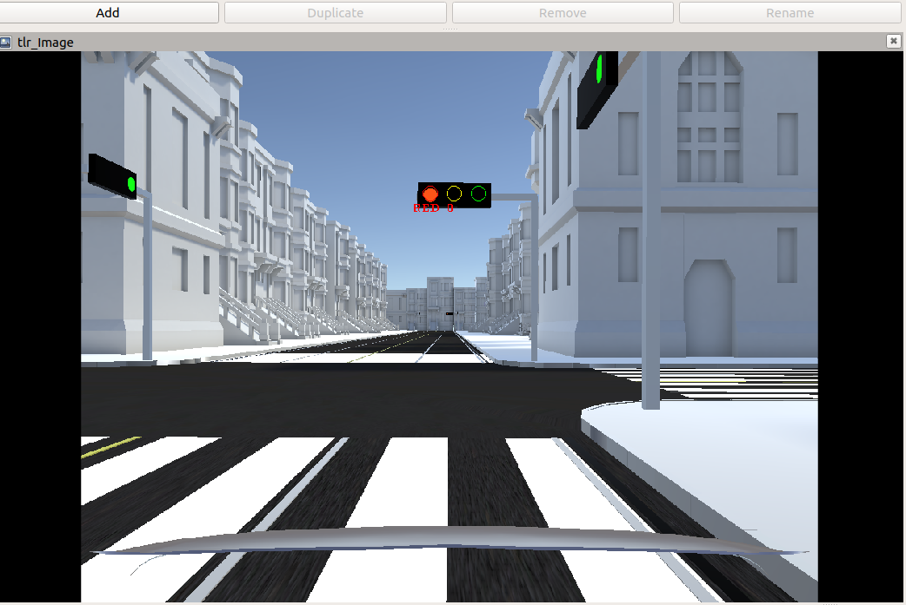
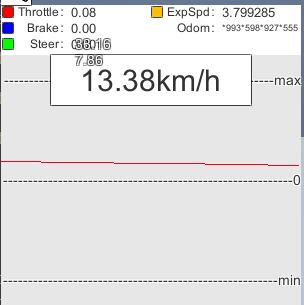

# Simulation

> AutoCore simulation tool virtualizes the real world driving scenarios based on Unity physical engine.  

## Table of Contents
1. [Overview](#overview)
2. [Requirement](#requirement)
   - [Simulator PC Requirement](#simulator-pc-requirement)
   - [Simulation Environment](#simulation-environment)
3. [Quick Start](#quick-start)
   - [Start Simulator](#start-simulator)
   - [Start PCU 1 with SDK](#start-pcu-1-with-sdk)
   - [Start PCU 2 with Autoware.AI](#start-pcu-2-with-autowareai)
   - [Simulation process](#simulation-process)
4. [Simulator Instruction](#simulator-instruction)
   - [Menu](#menu)
   - [Monitor](#monitor)
   - [Other operations](#other-operations)
   - [Log](#log)
5. [Interfaces](#interfaces)


## Overview

AutoCore simulation tool is developed based on Unity engine, which focuses kinematics principle of the vehicle and environment. It could simulate multi type of sensor inputs according to different driving cases and user configurable environmental conditions, so that the autonomous driving system could be tested and tuned in loop.

> NOTE: This guideline works with Autocore SDK and Autocore Simulator. If you would like to run Autoware.AI with Autocore simulator, please refer to:   
> [Simulation with Autoware.AI](docs/Simulation_autoware.md)

## Requirement

### Simulator PC Requirement

OS: Windows 10  
CPU：Intel i5 9100 or higher  
GPU：GTX 750Ti or higher  
Memory：>8G  
Free disk：>1GB  

### Simulation Environment

To use the simulator, you will need to build a simulation environment. In our case, we use one PC and two PCU dev boards. 


- PCU dev boards x 2
  - Roscore
  - Localization
  - LiDAR perception
  - Traffic light detection (optional with TPU accelerator)
  - Global planner
  - Local planner
  - Waypoint follower
- Simulator PC (Windows)
  - Simulator
  - AutoCore IDE

## Quick Start

### Start rviz
1. Start rviz at laptop connected to this network(ROS1 should be installed on this pc)


### Start Simulator

1. Download the simulator archive file, and extract it to a customized destination.  
   Download link: [Resource Download](Resource_download.md#simulation)

2. Double click `Simulator.exe` to run the simulator.  
   
  
3. Configure the ROSMaster IP and local IP, and choose the driving scenario, then click launch.  
    

4. If the configuration is correct, you will see the main window of the simulator as below:  
    

Once simulator is started and PCU is on，you will be able to see points map, vector map and correct NDT location in RVIZ.

Simulator will send out `/points_map`,`vector_map`,`/gnss_pose`,`/estimate_twist` and the TF for map to base_link transform. 

### Start PCU 1 with SDK

After power on, PCU will automatically start runtime，and IDE tool is able to control the different functionalities. Roscore will start on PCU automatically.

Use IDE tool to start the following nodes, the nodes which are not listed in below shall not be started (Some nodes may be configured as auto start, but without actual function).  
  
 
 
 


The following nodes are compulsory for simulation:
- `voxel_filter`
- `ndt_matching` with `init_pos_gnss` enabled
- `pose_vel_connector`

The following nodes are optional depending on functions:

- `ray_ground_filter`, make sure to disable `output_ring`
- `cluster_dep`
- `cluster_euc`
- `gps_localizer`  
  *To use this node, NDT node need to be stopped.*

The following node is optional to use traffic light function:

- `feat_proj`  
   *This node is provided in MPU image, but need to build before use. Google TPU is compulsory for this function.*  
   To build and launch this node:
   ```bash
   mkdir -p workspace/src
   cp ~/Camera-ROS-Git workspace/src/
   cd workspace/src
   catkin_init_workspace
   cd ..
   catkin_make(There\'s known bug, if there\'re error when compile codes, please execute this command again)
   # After build success
   source devel/setup.bash
   roslaunch front_detect front_detect.launch
   ```

### Start PCU 2 with Autoware.AI

In our case we will use Autoware.AI running on PCU for planning features.

As optional, you could also run Autoware.AI on the Windows PC with VM or WSL2. In this way, the 2nd PCU will not be required.

1. Change the Internal network IP of PCU 2 to a different one with PCU 1.  
   For IP configuration, please refer to [Advanced Network Settings](Pcu_setup.md#advanced-network-settings)

2. Connect to PCU 2 via VNC using default user name and password.

3. Distribute Autoware.ai 1.14 as following steps:

    ```bash
    mkdir ~/shared_dir && cd ~/shared_dir  
    ```
   - copy file "autoware.ai-planner-simu.launch" to folder   
   ```bash 
   wget -O run.sh https://gitlab.com/autowarefoundation/autoware.ai/docker/raw/master/generic/run.sh?inline=false 

   sudo chmod +x run.sh

   . run.sh --ros-distro melodic --tag-prefix 1.14.0 --cuda off --image autoware/arm64v8

   ```
   - Make sure distribute Autoware.ai 1.14 docker successfully 

4. Enter docker view

5. Set ROS_MASTER_URI according to PCU 1, ROS_IP according to PCU 2. 

6. Input following commands
   ```bash
   source /opt/ros/melodic/setup.bash
   source ~/Autoware/install/setup.bash
   ```
7. Open folder "~/shared_folder", then input following commands:

   ```bash
   roslaunch autoware.ai-planner-simu autoware.ai-planner-simu.launch
   ```
   This launch file can start all the planner nodes quickly, if you want to start planner step by step then jump to step 8, otherwise jump to step 9.

8. Launch the required planning nodes by Runtime Manager GUI or ROS commands.

   The following three nodes are required to run the simulation.

   - Global Planner  
     `op_global_planner`

   - Local Planner  
     `op_local_planner` or `lane_planner`

   - Waypoint follower  
     `pure_pursuit`

9. Set target point at rviz, then planner will drive ego car at simulation automatically.

### Test TLR
1. Add node /tlr_superimpose_image/Image at RVIZ，a samll window will display TLR recognition results at RVIZ.
  
  


### Simulation process

Now you could check whether all the topics are correctly sent from PCU, simulator and Autoware.AI. If no issues, we could begin the first drive.

1. Localization  
   Reset the car location in the simulator, and check in localization result of PCU in IDE. If the localization result is not matching with the car location in the simulator, please manually set the location in IDE.

2. Path planning 
   Select a destination point in IDE, and wait for the global planner & local planner to calculate the route.

3. Start the vehicle  
   After enable the way point follower, you should see the car starts moving in both IDE and simulator.

## Simulator Instruction

### Menu

There are some buttons on the top of the main interfaces:

1. Car Reset  
   Click to reset the ego car location to the default starting point.

2. Car Pose Set  
   Click to pick a location for ego car, then move the mouse to set the orientation.

3. Add Static Obstacle  
   Click to drop a obstacle at target place.

4. Add Human  
   Click to add a pedestrian at the target place, multiple pedestrians could be added via multiple clicks. Right click to finish. 

5. Add CarAI  
   Click to add a AI car at the target place, then click to add the destination for the AI car. AI car will run in the map according to the destination and follow traffic rules autonomously.

6. Remove All Obstacle  
   Click to remove all obstacles.

7. Settings  
   Click to open setting panel.

8. Exit Simu  
   To exit simulator and go back to the launch panel.

### Monitor



The monitor shows the current ego vehicle information, and draws diagram with historic data. To hide the monitor,just click the button on the left top. 

### Other operations

- Left click to select target
- Right click to cancel
- Press the wheel and drag to move camera
- Move the wheel to zoom
- Press Ctrl and move the wheel to change the size of target
- Space: Reset camera
- "C": Switch camera in simulator
- "W": Move forward
- "S": Move backward
- "A": Left turn
- "D": Right turn
- "X": Brake
- "Ctrl + A" Exchange dirve mode between ROS Diving and Manuual Driving

### Log

The log output is under `StreamingAssets/TestData` folder. The log file is named by time, with all the operations and accidents recorded.

## Interfaces

Publications:  
* /camera/camera_info [sensor_msgs/CameraInfo]  
* /estimate_twist [geometry_msgs/TwistStamped]  
* /gnss_pose [geometry_msgs/PoseStamped]  
* /image_raw [sensor_msgs/Image]  
* /ndt_pose [geometry_msgs/PoseStamped]  
* /points_raw [sensor_msgs/PointCloud2]  
* /tf [tf2_msgs/TFMessage]  
* /vehicle_status [autoware_msgs/VehicleStatus]  
* /tlr_superimpose_image [Camera/DepthCloud/Image]

Subscriptions:  
* /ide_cmd [unknown type]  
* /twist_cmd [geometry_msgs/TwistStamped]  
* /Camera [Camera/DepthCloud/Image]

